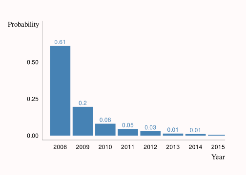
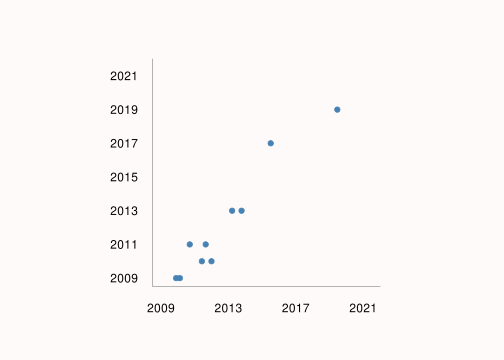
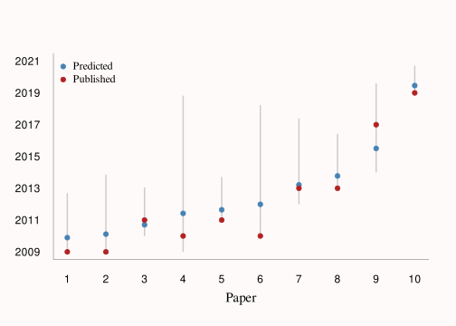

Estimating dates of scientific papers
================
Adam Bartonicek (abar435)
14/06/2021

### Scientific papers and cable cars

Recently, I came across an interesting little problem. I was doing some
background reading on interactive data visualization and I was about
half way through a paper ([An introduction to rggobi by Hadley Wickham
and Michael Lawrence](https://vita.had.co.nz/papers/rggobi-rnews.pdf)),
when I noticed that the article did not report its own publication date.
The article did, however, reference five other articles in its
bibliography, which were dated 2001, 2003, 2007, 2007, and 2008
respectively.

I felt a bit frustrated because I actually wanted to know the paper’s
publication date (for context) and a quick search of Google Scholar
didn’t return anything useful. It got me thinking:

> Is there a way to estimate when an article has been published, from
> the publication years of its references alone?

I toyed around with the problem in my head for a while. Eventually, I
remembered an exercise described in Chapter 2 of the official Bible of
Bayesian Statistics, [Bayesian Data Analysis
3](http://www.stat.columbia.edu/~gelman/book/). The exercise starts out
with the following description: you and your friend observe a single
cable car with the serial number “203” on it, your friend asks you to
estimate how many (*N*) cable cars there are in total.


> Photo by
> [CHUTTERSNAP](https://unsplash.com/@chuttersnap?utm_source=unsplash&utm_medium=referral&utm_content=creditCopyText)
> for
> [Unsplash](https://unsplash.com/s/photos/cable-car?utm_source=unsplash&utm_medium=referral&utm_content=creditCopyText)

The exercise may seem ridiculous on its face. Just how the hell are you
supposed to estimate how many cars there are after seeing just one
number? However, once you think about it a bit, it starts making more
sense. For example, we can intuitively guess that the total count of
cars probably isn’t 1,000,000, because if it was then the chance of
seeing the lucky 203 would be one-in-a-million. With 500,000 cars, the
chance of seeing 203 is 1 in 500,000, with 100,000 cars, it’s - you
guessed it - 1 in 100,000, and so on and so on. Finally, we arrive at
the conclusion that the most probable total count of cars is 203, as the
chance of seeing our car is then 1 in 203 (and there have to be at least
203 cars)!

The cable car problem has one more interesting statistical aspect to it.
Suppose you worked through the reasoning above. Your friend has means of
finding out how many cable cars there are and wants to make a bet with
you. What number should you bet on? You might be tempted to go for the
lucky 203 since we’ve just shown it’s the most probable number of cars.
However:

> Even though *N* = 203 is the most probable count of cars, that doesn’t
> mean this is the number you should bet on.

For example, imagine you have to pay out $1 for every car that your
estimate is off by. This is not a fair bet by any stretch of the
imagination but bear with me! When you lose as many dollars as you
misjudge the number of cars, then betting on 203 is a bad choice: you
can only either be right on the money and lose $0 (if the true count is
exactly 203), or undershoot and potentially lose a fair buck (if the
true count is greater). If you bet on 203 and later find out there are
in fact 400 cars, then you will will lose $197 dollars! It might be
better to place the bet in such a way so that you are *more likely to be
off by a little-bit but less likely to incur a large loss*.

It turns out that in the absence of any known specific set of payoffs
for the bet (what statisticians call by the fancy term “loss function”),
a good default choice is something called posterior mean. What’s the
“posterior mean” you’re asking? *It’s a “bad ass” way to estimate
parameters, haha, get it… (please don’t put me down for this terrible
joke, I’m sure someone else must’ve made it before me)*. Joking aside,
posterior mean is the bread and butter estimator in Bayesian statistics,
and you can learn all about it in courses on Bayesian statistics [such
as this
one](https://www.youtube.com/watch?v=P_og8H-VkIY&list=PLwJRxp3blEvZ8AKMXOy0fc0cqT61GsKCG).

Going back to my publication year problem, I realized that what I had
was a variation cable car problem. I observed 5 references with specific
years (in place of the one cable car) and wanted to use those to
estimate the year the original paper was published (in place of the
total count of cable cars). I wanted to figure out some way of placing
an informed bet on what the true publication year (an unobserved
parameter) could be, and I realized I could do this by estimating the
posterior mean.

### Journey to the edge of the parameter space

In comparison to estimation of the wide-spread frequentist models (the
ones you would’ve learned about in your typical STATS101 course),
Bayesian estimation is often a lot more challenging. Specitfically,
frequentist models are usually easier to fit since they are based on a
handy method called maximum likelihood estimation (MLE) - you find the
single most likely value of the parameter you’re interested in, and then
go from there. In contrast, in Bayesian models, you want to estimate the
entire distribution of values that your parameter **could** take (called
the posterior), not just the most likely value, and so MLE is not
enough. This makes Bayesian models more challenging both mathematically
and computationally.

There are two broad approaches for estimating Bayesian models. First, a
few well-behaved, simple models have forms that can actually be
estimated analytically (meaning that, if your math is good enough, you
can estimate them the old-fashioned way, by spending some quality time
with pen and paper). However, for many other models, the analytical
solutions are very complicated and involve high-dimensional integrals
that can be for all intents and purposes impossible to solve
analytically. Fortunately, some very clever people came up with ways to
estimate Bayesian models through random sampling methods. These methods
are broadly called Markov Chain Monte Carlo or MCMC in short, and they
allow for estimation of much more complicated and interesting models.

Since the cable car problem is fairly simple and involves only one
unknown parameter (*N*), it actually has some nice analytical solutions
(see the [solutions to the BDA3
exercises](http://www.stat.columbia.edu/~gelman/book/solutions3.pdf)
mentioned above). However, my publication year problem was more
complicated, since I needed to estimate **two** unknown parameters: the
upper and lower limits of the time-range from which Hadley and Mike were
picking their references. Therefore, I decided to estimate the model via
MCMC sampling instead of trying to come up with an analytical solution,
and use this as an opportunity to practice coding in Stan
(<https://mc-stan.org/>). Stan is a Bayesian probabilistic programming
language. In short, you can use Stan to describe probability models that
can then be estimated via a fancy kind of MCMC sampling called
Hamiltonian Monte Carlo. What you *really* need to know is that Stan is
an incredibly powerful and general tool for estimating all sorts of
Bayesian models. In short, for Bayesians, Stan is something like a
Swiss-army knife powered by nuclear fusion.

Anyway, before I started writing my Stan program, I first plugged my
data into R. This was very simple since the data were just the 5
reference years. I also loaded `cmdstanr`, an R package that provides a
light-weight interface to Stan, and registered the knitting engine:

``` r
# Observed years
years <- c(2001, 2003, 2007, 2007, 2008)

# Load cmdstanr & register knitr engine
library(cmdstanr)
register_knitr_engine()
```

Initially, I formulated my model in the following way: Mike and Hadley
drew their references randomly from a time-range specified by two
parameters: **A** and **B**. **A** represented the lower limit of the
time-range, i.e. the publication year of the oldest article they could
have possibly referenced. It could hypothetically take on any value from
minus infinity up to 2002 (the lowest observed year). However, as there
weren’t many papers on interactive data visualization published 50,000
years BCE (I think), I decided to constrain **A** to the more sensible
range of 1950 to 2002. Similarly, the parameter **B** represented the
upper limit on the time-range, and was naturally constrained to lie
between 2008 (the highest observed year) and 2021 (current date). As I
mentioned above, I was really only interested in parameter **B**: the
year Mike and Hadley finished writing their article (and, hopefully,
fairly close to the year the article was published). However, I needed
to model both **A** and **B** to fully account for the uncertainty in
the data generating process. Finally, I made the assumption that Mike
and Hadley chose the references from the time-range with *uniform
probability*, like drawing numbers from a hat. In succinct statistical
notation, we would express the model as such:


I coded up the model above in Stan like so:

``` stan
data {
    int<lower=0> N;          // Number of references
    vector[N] y;             // Observed reference years 
    int<lower=0> minyear;    // Minimum observed year
    int<lower=0> maxyear;    // Maximum observed year
  }
  
  parameters {
    real<lower=1950, upper=minyear> a;   // Parameter a
    real<lower=maxyear, upper=2021> b;   // Parameter b
  }
  
  model {
    y ~ uniform(a, b);       // We sample y from a Uniform(a, b) distribution
  }
```

The model code above looks pretty, doesn’t it? Unfortunately, when I fed
it into to Stan, bad times ensued. My console lit up with warnings about
divergent transitions. Divergent transitions are a very very bad thing
in the Stan world - if you get even just one divergent transition during
your sampling process, it indicates that your entire model fit may be
incorrect! So once again, it was time for my favourite Bayesian
pass-time: figuring out what went wrong.

First off, some Bayesian with a keen eye might immediately notice that I
didn’t specify any priors for **A** and **B** in the model block. For
models with complex structure and many parameters, good priors can
ultimately decide whether your model will fit nicely or choke and die.
If you fail to provide priors, Stan will pick wide, non-informative
priors by default, and these can sometimes be problematic. However,
priors weren’t the reason why my model failed to fit - my model was
fairly simple, and setting informative priors did not reduce the
divergent transitions.

Turns out that the real issue was much more interesting:

> Stan, like many other MCMC-based samplers, has a problem with sampling
> near the edges of the parameter space.

This means that if the most probable values of your parameters are close
to the limits of what the parameter could be, then the sampler is going
to struggle. In my problem, the parameter **B** was bounded below by the
year 2008. And what was the most probable value of this parameter? Also
2008. Thus, the posterior was sharply peaked at the value 2008 and the
sampler could only approach it from the right-hand tail (years greater
than 2008), but it could not go over that peak since there was nowhere
to go. It should have been obvious to me that this could cause problems,
but alas it is always easier to pinpoint your model’s problems in the
hindsight.


> Photo by [Jeremy
> Thomas](https://unsplash.com/@jeremythomasphoto?utm_source=unsplash&utm_medium=referral&utm_content=creditCopyText)
> for
> [Unsplash](https://unsplash.com/s/photos/space?utm_source=unsplash&utm_medium=referral&utm_content=creditCopyText)

Fortunately, once I knew what the problem was, it was easy to fix it
with a little bit of maths. First off, instead parametrising **A** and
**B** as the minimum and the maximum year, we can instead parametrise
them as the *difference* from the minimum and maximum observed year.
Second, instead of estimating these differences in natural units, we can
estimate them in log (natural logarithm) units. Transforming parameters
to a different scale is often a very useful trick in statistics, and in
this case estimating the log of **A** and **B** helped a lot since it
flattened the posterior and made the peak at the limit less sharp.
Finally, I included a half-normal(0, 10) prior on the log of **A** and
**B**, and since
, I had
to add and subtract 1 from the transformed (exponentiated) parameters.

In statistical notation:


``` stan
  
  data {
    int<lower=0> N;          // Number of references
    vector[N] y;             // Observed reference years 
    int<lower=0> minyear;    // Minimum observed year
    int<lower=0> maxyear;    // Maximum observed year
  }
  
  transformed data {
    real<lower=0> lminyear;    // Log of the minimum year
    real<lower=0> lmaxyear;    // Log of the maximum year
    
    lminyear = log(min(y) - minyear);
    lmaxyear = log(maxyear - max(y));
  }
  
  parameters {
    real<lower=0, upper=lminyear> log_a;    // Log of a
    real<lower=0, upper=lmaxyear> log_b;    // Log of b
  }
  
  model {
    log_a ~ normal(0, 10); // Half normal prior on the log of a
    log_b ~ normal(0, 10); // Half normal prior on the log of b 
    
    // Sample y from uniform distribution parametrised 
    // by the transformed parameters 1 + exp(log_a), 1 + exp(log_b)
    
    y ~ uniform(min(y) + 1 - exp(log_a),   
                max(y) - 1 + exp(log_b));
  }
  
  generated quantities {
    real year_max;
    year_max = max(y) - 1 + exp(log_b); // Generate random samples for max year
  }
  
```

I sampled this re-parametrized model using the following call to
`cmdstanr`:

``` r
# Sample from Stan model
output <- capture.output(
  fit1 <- mod1$sample(
  seed = 123456,
  data = list(N = length(years), y = years, 
              minyear = 1950, maxyear = 2021),
  refresh = 0
))
```

The model finished sampling nicely, with no divergent transitions and no
other problems. I extracted the posterior draws from the fitted model
object and used the to calculate a vector of posterior probabilities for
each of the potential years:

``` r
draws1 <- fit1$draws()
pred_years <- as.numeric(draws1[ , , 4, drop = TRUE])

probs <- (table(floor(pred_years)) / 4000)[1:8]
```

<!-- -->

Based on the model, there was about 60% probability that the article was
published in 2008, 20% probability that it was published in 2009, and
less than 20% probability than it was published anytime later.

``` r
probs_table <- rbind(probs)
rownames(probs_table) <- 'Probability'
knitr::kable(rbind(probs_table))
```

|             |   2008 |   2009 |    2010 |    2011 |   2012 |    2013 |  2014 |   2015 |
|:------------|-------:|-------:|--------:|--------:|-------:|--------:|------:|-------:|
| Probability | 0.6105 | 0.1955 | 0.08075 | 0.04525 | 0.0295 | 0.01375 | 0.011 | 0.0055 |

``` r
# Posterior mean
mean(pred_years)
```

    ## [1] 2009.259

The posterior mean was 2009.259. This represents our best guess of when
the article could have been published (or finished being written),
taking into account the uncertainty about upper and lower limits of the
time-range from which Hadley and Mike were picking their reference
papers.

I ended up doing some more digging around and eventually found out that
the true publication year for the article was in fact 2008 (on [Hadley
Wickham’s website](https://vita.had.co.nz/)). So in this case, the
simple rule of guessing the maximum observed value in the data (which
corresponds to the posterior mode) fared better than the posterior mean!

### Taking the model out for a spin

I wanted to see how well would my Stan model do with other papers. My
original plan was to do a little bit of webscraping and get a nice big
sample of references to articles (I decided to choose only articles by
Hadley Wickham, to establish some sort of theme). However, scraping the
articles turned out to be a bit more than I bargained for. I was able to
download article pdfs and scrape them for text just fine, however, I ran
into problems with some journals using bibliography styles that clashed
with in-text citations. Eventually, in the interest of not sinking too
much of my life into this minor project, I swallowed my pride and ended
up doing the data entry manually, recording the reference years of 10
papers into a plan text file by hand. You can see the fruits of my
labour below.

As for the analysis, I took my model and the data from the 10 papers and
ran the sampling again, once for each paper. I had to make some slight
adjustments. First, since the earliest referenced paper was from the
year 1857, I had set the limit for **A** lower, to 1800. Likewise, there
were several cited references from 2021, and since the parameter limits
on the parameter range are exclusive, I had to increase the upper limit
of **B** to 2022.

I used the models to estimate the predicted year (posterior mean) for
each of the 10 papers, as well as 95% credible intervals for the same
parameter:

``` r
pprs <- readLines('hadley_papers.txt') # Load in the data
pprs <- lapply(pprs, strsplit, ', ')

str(pprs)
```

    ## List of 10
    ##  $ :List of 1
    ##   ..$ : chr [1:9] "ggplot2" "2011" "2010" "2005" ...
    ##  $ :List of 1
    ##   ..$ : chr [1:12] "The split-apply-combine strategy for data analysis" "2009" "2007" "2005" ...
    ##  $ :List of 1
    ##   ..$ : chr [1:33] "Welcome to the Tidyverse" "2019" "2018" "2014" ...
    ##  $ :List of 1
    ##   ..$ : chr [1:15] "ggmap: spatial visualization with ggplot2" "2013" "2013" "2013" ...
    ##  $ :List of 1
    ##   ..$ : chr [1:26] "A layered grammar of graphics" "2010" "1996" "1983" ...
    ##  $ :List of 1
    ##   ..$ : chr [1:19] "Dates and times with lubridate" "2011" "2009" "2010" ...
    ##  $ :List of 1
    ##   ..$ : chr [1:44] "Statistical inference for exploratory data analysis and model diagnostics" "2009" "2008" "1981" ...
    ##  $ :List of 1
    ##   ..$ : chr [1:22] "Letter-value plots: boxplots for large data" "2017" "1977" "2003" ...
    ##  $ :List of 1
    ##   ..$ : chr [1:39] "The generalized pairs plot" "2013" "1935" "1999" ...
    ##  $ :List of 1
    ##   ..$ : chr [1:18] "Graphical inference for infovis" "2010" "2009" "1954" ...

``` r
ppr_names <- unlist(lapply(pprs, function(x) x[[1]][1]))
ppr_pub_years <- as.numeric(unlist(lapply(pprs, function(x) x[[1]][2])))
ppr_ref_years <- lapply(pprs, function(x) as.numeric(x[[1]][-c(1, 2)]))

ppr_pred_years <- numeric(10)
ppr_pred_cis <- matrix(0, 2, 10)

# Iterate throught the data for the 10 papers
for (i in 1:10) {

  # Get the data for that specific paper
  yrs <- as.numeric(ppr_ref_years[[i]]) 
  
  # Fit a model for the paper
  output <- capture.output(
    fit <- mod1$sample(
    seed = 123456,
    data = list(N = length(yrs), y = yrs, 
              minyear = 1800, maxyear = 2022),
    refresh = 0
    ))
  
  # Extract posterior draws and calculate predicted year and credible interval
  draws <- fit$draws()
  ppr_pred_years[i] <- mean(draws[ , , 4, drop = TRUE])
  ppr_pred_cis[, i] <- quantile(draws[ , , 4, drop = TRUE], 
                                c(0.025, 0.975))

}
```

Again, all of the models sampled nicely. Unsurprisingly, the predicted
years seemed to correlate fairly well with the true observed years:

<!-- -->

This isn’t anything shocking since we would probably get similarly
strong correlation by just using the maximum observed reference years.
However, it is nice to see that our models aren’t predicting some
completely nonsense values.

Additionally, all of the 95% credible intervals for the 10 papers
contained the true publication year:

<!-- -->

Again, this is not something groundbreaking, with 10 observations and
95% credible intervals we would have to be fairly unlucky to get one or
more observations outside of the interval. However, again, it’s nice to
see that the models seem to handle the underlying uncertainty of the
publication year well. Additionally, the figure above nicely illustrates
the asymmetry of the posterior - while the posterior mean is usually
fairly close to the posterior mode (lowest observed year), the 95%
credible intervals capture the long-tail of the posterior distribution
by stretching further into the future, away from the mean and mode.

Finally, I compared the two estimation methods - posterior mean vs
picking the maximum observed value in the data - via root-mean-squared
error (RMSE).

``` r
ppr_max_years <- unlist(lapply(ppr_ref_years, max))

rmses <- cbind(
  `Posterior mean` = sqrt(mean((ppr_pub_years - ppr_pred_years)^2)),
  `Maximum data value` = sqrt(mean((ppr_pub_years - ppr_max_years)^2)))
rownames(rmses) <- 'RMSE'

knitr::kable(rmses)
```

|      | Posterior mean | Maximum data value |
|:-----|---------------:|-------------------:|
| RMSE |       1.078406 |           1.095445 |

Both methods had comparable performance, with the posterior mean having
a marginally lower RMSE, indicating a better performance. However, we
shouldn’t put much stock into this comparison. With the small sample
size of only 10 papers, any sort of estimate of predictive performance
is going to be very noisy. At least it seems that the posterior mean
isn’t grossly worse than the “folk” strategy of picking the largest
observed data point.

Finally, I compared the observed years vs. the predicted years from the
two methods:

``` r
pred_table <- rbind(ppr_pub_years, ppr_pred_years, ppr_max_years)
rownames(pred_table) <- c('Published year', 'Posterior mean', 
                          'Data maximum')
colnames(pred_table) <- paste('Paper', 1:10)

knitr::kable(pred_table)
```

|                |  Paper 1 |  Paper 2 |  Paper 3 |  Paper 4 |  Paper 5 |  Paper 6 |  Paper 7 |  Paper 8 |  Paper 9 | Paper 10 |
|:---------------|---------:|---------:|---------:|---------:|---------:|---------:|---------:|---------:|---------:|---------:|
| Published year | 2011.000 | 2009.000 | 2019.000 | 2013.000 | 2010.000 | 2011.000 | 2009.000 | 2017.000 | 2013.000 | 2010.000 |
| Posterior mean | 2010.702 | 2010.116 | 2019.459 | 2013.776 | 2011.421 | 2011.647 | 2009.894 | 2015.505 | 2013.216 | 2011.991 |
| Data maximum   | 2010.000 | 2009.000 | 2019.000 | 2013.000 | 2009.000 | 2011.000 | 2009.000 | 2014.000 | 2012.000 | 2010.000 |

By comparing the observed and predicted years, we can see that the
posterior mean does what we set out to do with it at the start. By
incorporating the uncertainty about the unobserved parameters, the
posterior mean slightly over-predicts the publication year for many
papers, but reduces the magnitude of large misses when they happen (see
paper 8). In contrast, the posterior mode method (“pick the maximum
observed year”) is right on the money most of the time, but will
sometimes lead to large blunders.

Which method we should prefer depends on how we approach errors. Do we
want to reduce the impact of large errors? Then we should pick the
posterior mean. Do we not care about the size of the errors & just care
about being right on average? The posterior mode will probably do just
fine. Finally, if we had a specific loss function, for example if I knew
that I would get $5 if my estimate was within 5 years of the true value
but lose $10 if it wasn’t, then it may be best to come up with a custom
estimator that would minimize this specific loss function.

Additionally, instead of fitting models for the 10 papers separately, we
may get better estimates by combining the information from all of the
data simultaneously through multilevel (aka mixed effects/hierarchical)
modeling. Multilevel modeling is a very useful framework for modeling
data which has some inherent hierarchical structure to it, and is one of
the main reasons why I ever got into Bayesian statistics and statistics
in general! However, in the interest of keeping this project to a
manageable size for both me and the reader, I will leave multilevel
modeling for another time.

This has been a fun little project for me to work on. I hope you got
something out of it, whether it’s learning a little bit about
probability and decision-making, having a glimpse into Bayesian modeling
and Stan, or at least getting to look at few pretty graphs!

If you have any feedback or find any problems in my code or models,
please don’t hesitate to contact me at my personal email:
<bartonicek@gmail.com>

Happy modeling!
